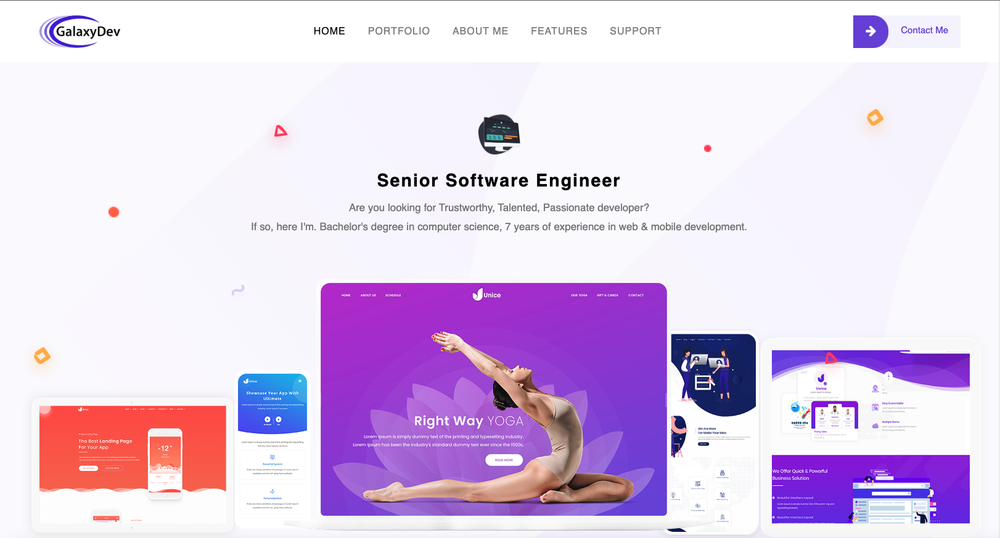

<!-- 

    

 -->

<h1 align="center">
    Hi , I'm HaiQuan(Eddy) Huang
</h1>

    

<!-- About Section -->
<!-- 
 -->
  <!-- 
 -->
<b>👤 About</b>
  <!-- 
 -->

    
      
<!-- <blockquote> -->

✅ HIGH skilled, 🚀HIGH speed and 🌟HIGH motivated Web/Mobile developer with over 7 years of experience.

I'm a senior software engineer based in Beijing, China. And I love writing code!
  
I care a lot about privacy and security, and have carried out several audits and have made numerous submissions to various bug bounty programs.

I have a small homelab, which I'm using to learn more about system administration, and host my own services. 

When I'm not at the keyboard, I like sports, photography and hanging out with friends.

<!-- </blockquote> -->
    
----
  

<!-- 
 -->

<!-- Tech Stack -->  

  
<b>🛠️ Tech Stack</b>

  
   
   
    

| **Category** | **Technologies** |
| - | - |
**Frontend** |           
**Backend** |      
**Core** |         
**Mobile** |     
**Cloud** |     
**DevOps** |   
**Testing** |   
**Misc** |   
**Editors** |  
      
 <!-- See **[➡️ Full Tech Stack](https://github.com/galaxydeve/galaxydeve/blob/master/TECH-STACK.md)**, for a list of projects using each of the above technologies -->
----      
  

<!-- Portfolio Section -->

  

  My Portfolio Website
  

  

    <!-- <h3 align='left' style='margin: 16px 4px;'>
        <a href='https://github.com/galaxydeve/portfolio'>Please click here to navigate my portfolio website</a>
    </h3>
    <h3 align='left' style='margin: 16px 4px;'>
        This portfolio website was built with React.js, Next.js and used Contentful as CMS.
    </h3> -->
    <h2>Comming Soon</h2>
    <!-- <a href='https://github.com/galaxydeve/portfolio'> -->
    
  

<!-- Metrics -->

  
<b>📊 Metrics</b>

    

|  |  |
| - | - |

**[➡️ More Metrics](/METRICS.md)**

<!-- Snek -->   

### 𝚂𝚑𝚘𝚠 𝚜𝚘𝚖𝚎 ❤️ 𝚋𝚢 𝚜𝚝𝚊𝚛𝚛𝚒𝚗𝚐 𝚜𝚘𝚖𝚎 𝚘𝚏 𝚝𝚑𝚎 𝚛𝚎𝚙𝚘𝚜𝚒𝚝𝚘𝚛𝚒𝚎𝚜!

